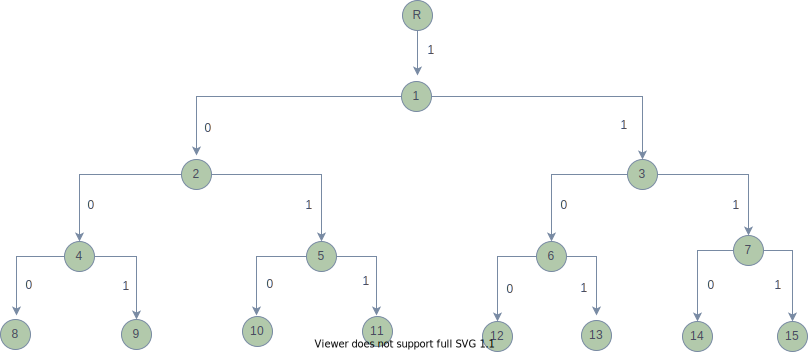

### Question 1

```python
python3 question-1.py
```
### Question 2

```python
python3 question-2.py
```
Simulation for question 2:


<div style="text-align: center;">
    
</div>


### Question 3

```
g++ -std=c++11 -O3 -o soln question-3.cpp
./soln  
```
